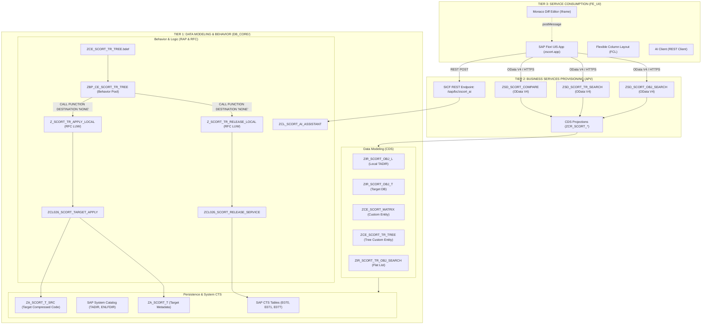
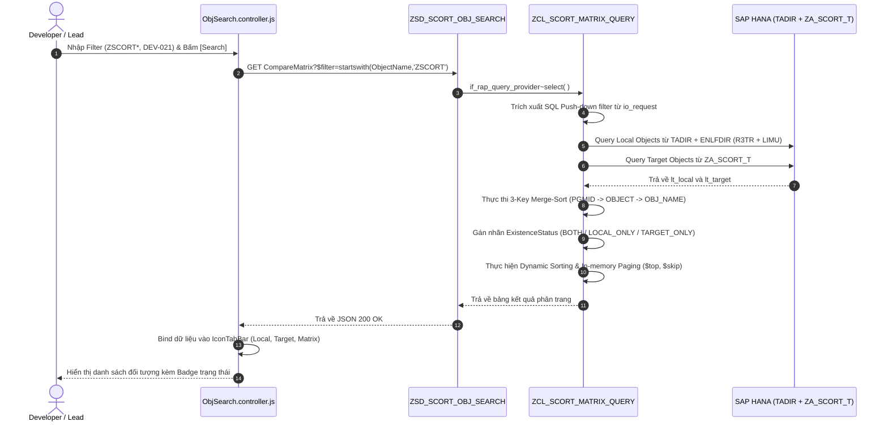
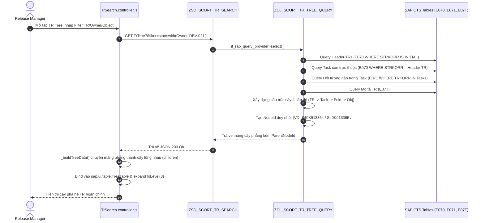
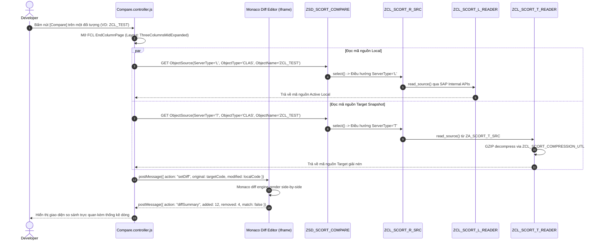
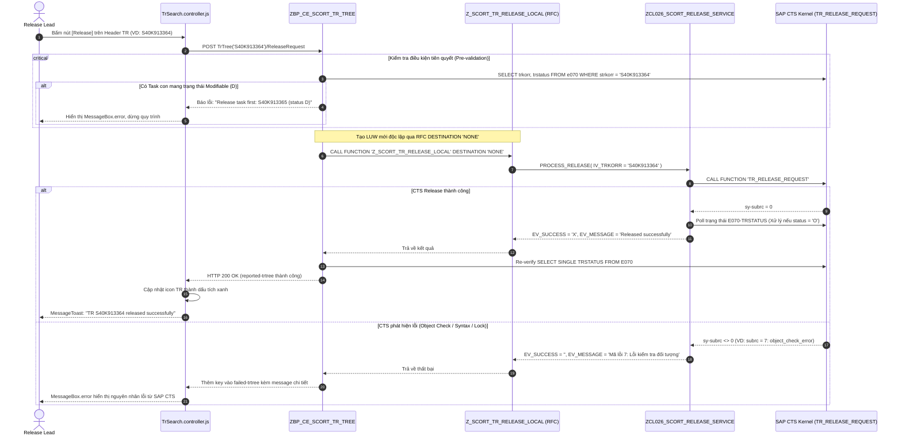
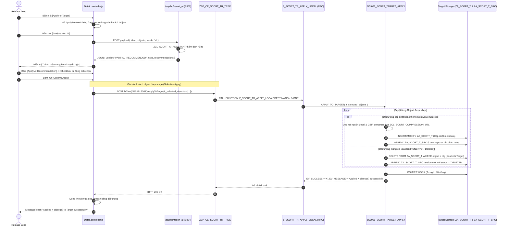

# SCORT — TÀI LIỆU THIẾT KẾ & TRIỂN KHAI KỸ THUẬT
## (Technical Design & Implementation Document)
### Dự án: SAP Cross-system Object Replication Toolkit (SCORT)
### Mã dự án: GSU26_SAP05 | Phiên bản: 2.0 (Enterprise Release)

---

## MỤC LỤC
1. [Tổng Quan Công Nghệ & Hạ Tầng (Technology Stack & Infrastructure)](#1-tổng-quan-công-nghệ--hạ-tầng)
2. [Kiến Trúc Hệ Thống & Phân Tầng (System Architecture & 3-Tier Clean Pattern)](#2-kiến-trúc-hệ-thống--phân-tầng)
3. [Luồng Hoạt Động & Biểu Đồ Trình Tự (Workflows & Activity Diagrams)](#3-luồng-hoạt-động--biểu-đồ-trình-tự)
   - [3.1. Luồng 1: Tra Cứu Đối Tượng & Merge-Sort Matrix Query](#31-luồng-1-tra-cứu-đối-tượng--merge-sort-matrix-query)
   - [3.2. Luồng 2: Duyệt Cây Phân Cấp Transport Request (TR Tree & Flat List)](#32-luồng-2-duyệt-cây-phân-cấp-transport-request-tr-tree--flat-list)
   - [3.3. Luồng 3: Đối Soát Mã Nguồn & Tích Hợp Monaco Diff Editor](#33-luồng-3-đối-soát-mã-nguồn--tích-hợp-monaco-diff-editor)
   - [3.4. Luồng 4: Quy Trình Release TR/Task An Toàn (Safe TR Release)](#34-luồng-4-quy-trình-release-trtask-an-toàn-safe-tr-release)
   - [3.5. Luồng 5: Áp Dụng Snapshot Sang Target, Chọn Lọc & Xử Lý Xoá (Apply to Target)](#35-luồng-5-áp-dụng-snapshot-sang-target-chọn-lọc--xử-lý-xoá-apply-to-target)
4. [Tương Tác Giữa Các Hệ Thống & Cơ Chế Cô Lập LUW (System Interactions & LUW Isolation)](#4-tương-tác-giữa-các-hệ-thống--cơ-chế-cô-lập-luw)
5. [Danh Mục Chi Tiết Các DEV Objects (Comprehensive DEV Objects Registry)](#5-danh-mục-chi-tiết-các-dev-objects)
   - [5.1. Tầng Cơ Sở Dữ Liệu & Từ Điển Dữ Liệu (DDIC)](#51-tầng-cơ-sở-dữ-liệu--từ-điển-dữ-liệu-ddic)
   - [5.2. Tầng Data Modeling (CDS View Entities & Custom Entities)](#52-tầng-data-modeling-cds-view-entities--custom-entities)
   - [5.3. Tầng Behavior & Logic Xử Lý (BDEF, Behavior Pools & ABAP Classes)](#53-tầng-behavior--logic-xử-lý-bdef-behavior-pools--abap-classes)
   - [5.4. Tầng Business Services Provisioning (API Projections & Services)](#54-tầng-business-services-provisioning-api-projections--services)
   - [5.5. Tầng Service Consumption (SAP Fiori UI5 Frontend)](#55-tầng-service-consumption-sap-fiori-ui5-frontend)
6. [Thiết Kế & Định Nghĩa Màn Hình (Screen Layout & Screen Definitions)](#6-thiết-kế--định-nghĩa-màn-hình)
7. [Hướng Dẫn Triển Khai, Kích Hoạt & Vận Hành (Deployment & Configuration Guide)](#7-hướng-dẫn-triển-khai-kích-hoạt--vận-hành)

---

## 1. TỔNG QUAN CÔNG NGHỆ & HẠ TẦNG

### 1.1. Công nghệ Nền tảng (Core Tech Stack)
- **Hệ thống Máy chủ Backend:** SAP S/4HANA (System ID: `S40`, Client: `324`).
- **Nền tảng ABAP:** ABAP Platform 2022/2023 (ABAP Cloud Ready, Language Version: Standard / ABAP for Cloud Development).
- **Kiến trúc Lập trình:** **SAP RAP (ABAP RESTful Application Programming Model)**, triển khai theo mô hình Managed & Unmanaged Scenario kết hợp Custom Query Provider.
- **Giao thức Truyền thông:** **OData V4 (OData Version 4.0)** chuẩn quốc tế, hỗ trợ batch processing `$batch`, phân trang `$top`, `$skip`, và `$filter`.
- **Cơ sở dữ liệu:** SAP HANA In-Memory Database, tận dụng tối đa kỹ thuật Code Push-Down (CDS View Entities, Window Functions, Built-in SQL Functions).
- **Trình soạn thảo So sánh Mã nguồn:** **Monaco Editor** (trình soạn thảo lõi của VS Code), nhúng thông qua kênh truyền thông an toàn HTML5 `postMessage` trong Iframe.
- **Cơ chế Nén:** Thuật toán GZIP nhị phân tích hợp qua lớp chuẩn `cl_abap_gzip`.
- **Động cơ Trí tuệ Nhân tạo (AI Engine):** Google Gemini Pro / Flash API kết hợp cơ chế xoay tua khóa an toàn (API Key Rotation) và SAP AI Core BTP Destination Adapter.
- **Giao diện Người dùng (Frontend):** **SAPUI5 (OpenUI5 Version 1.120.0)**, kiến trúc Fiori Flexible Column Layout (FCL) 3 cột linh hoạt.

---

## 2. KIẾN TRÚC HỆ THỐNG & PHÂN TẦNG (3-TIER CLEAN ARCHITECTURE)

Hệ thống SCORT được tổ chức nghiêm ngặt theo mô hình 3 phân tầng chuẩn mực của SAP RAP (Clean Architecture):



### Chi tiết vai trò từng tầng:
1. **Tier 1 - Data Modeling & Behavior (`DB_CORE/`):**
   - Định nghĩa mô hình dữ liệu lõi thông qua CDS View Entities và Custom Entities.
   - Cung cấp các Query Provider (`ZCL_SCORT_*_QUERY`) để xử lý các phép toán phức hợp ngoài khả năng của SQL cơ bản (Merge-Sort, Tree Traversal, GZIP Decompression).
   - Thực thi nghiệp vụ qua Behavior Definition (BDEF), bọc các thao tác thay đổi trạng thái trong các Function Module RFC-enabled để tạo LUW độc lập.
2. **Tier 2 - Business Services Provisioning (`API/`):**
   - Tinh gọn và cấu hình giao diện UI thông qua CDS Projection Views (`ZCR_*`).
   - Công bố các dịch vụ OData V4 Service Definitions (`ZSD_*`) và Service Bindings (`UI_*_O4`).
   - Cung cấp cổng kết nối RESTful SICF Endpoint `/sap/bc/zscort_ai` phục vụ AI Review độc lập.
3. **Tier 3 - Service Consumption (`FE_UI/`):**
   - Ứng dụng Fiori đơn trang (Single Page Application - SPA) tuân thủ tiêu chuẩn SAP Fiori Design Guidelines.
   - Điều phối 3 cột layout bằng `FlexibleColumnLayout` giúp người dùng không bao giờ mất ngữ cảnh làm việc.

---

## 3. LUỒNG HOẠT ĐỘNG & BIỂU ĐỒ TRÌNH TỰ (WORKFLOWS & ACTIVITY DIAGRAMS)

### 3.1. Luồng 1: Tra Cứu Đối Tượng & Merge-Sort Matrix Query



---

### 3.2. Luồng 2: Duyệt Cây Phân Cấp Transport Request (TR Tree & Flat List)



---

### 3.3. Luồng 3: Đối Soát Mã Nguồn & Tích Hợp Monaco Diff Editor



---

### 3.4. Luồng 4: Quy Trình Release TR/Task An Toàn (Safe TR Release)



---

### 3.5. Luồng 5: Áp Dụng Snapshot Sang Target, Chọn Lọc & Xử Lý Xoá (Apply to Target)



---

## 4. TƯƠNG TÁC GIỮA CÁC HỆ THỐNG & CƠ CHẾ CÔ LẬP LUW

### 4.1. Bản chất sự cố `CX_RAP_ILLEGAL_STATEMENT` trong SAP RAP
Trong kiến trúc chuẩn của SAP RAP, toàn bộ các thao tác đọc/ghi trong một request được kiểm soát bởi **Transactional Buffer** của RAP Runtime. RAP quản lý vòng đời transaction thông qua 2 pha: **Interaction Phase** và **Save Sequence**.
- **Quy tắc cấm kỵ:** Trong Interaction Phase (nơi các Action của BDEF được thực thi), việc gọi trực tiếp bất kỳ câu lệnh nào làm thay đổi hoặc kết thúc LUW cơ sở dữ liệu như `COMMIT WORK`, `ROLLBACK WORK`, hoặc lời gọi BAPI/CTS ngầm có `COMMIT` sẽ ngay lập tức kích hoạt lỗi nghiêm trọng của SAP Kernel:
  ```
  Runtime Error: BEHAVIOR_ILLEGAL_STATEMENT
  Exception: CX_RAP_ILLEGAL_STATEMENT
  Short Text: Statement COMMIT WORK is not allowed in the current phase of the RAP transaction.
  ```

### 4.2. Giải pháp Kiến trúc: Cô lập LUW bằng RFC Wrapper (`DESTINATION 'NONE'`)
Để tích hợp an toàn với các API truyền thống của SAP CTS (`TR_RELEASE_REQUEST`) và cơ chế lưu trữ snapshot Target, hệ thống SCORT thiết kế kiến trúc phân lập LUW thông minh:

```
[ BDEF Action Handler: ReleaseRequest / ApplyToTarget ]
                     │
                     │ (Chạy trong RAP Transactional Buffer - KHÔNG COMMIT)
                     ▼
         CALL FUNCTION 'Z_SCORT_TR_RELEASE_LOCAL'
              DESTINATION 'NONE'
                     │
                     │ (Tạo một RFC Session độc lập - LUW riêng biệt)
                     ▼
  [ Function Module RFC: Z_SCORT_TR_RELEASE_LOCAL ]
                     │
                     ├──> Gọi ZCL026_SCORT_RELEASE_SERVICE
                     │         └──> Gọi CTS API: TR_RELEASE_REQUEST
                     │                   └──> COMMIT WORK hợp lệ trong LUW riêng
                     │
                     └──> Bắt ngoại lệ cx_root, trả về EV_SUCCESS / EV_MESSAGE
                     ▲
                     │ (Trả dữ liệu về RAP Action)
                     │
[ BDEF Action Handler: Nhận kết quả -> Cập nhật reported/failed -> Kết thúc an toàn ]
```

---

## 5. DANH MỤC CHI TIẾT CÁC DEV OBJECTS (DEV OBJECTS REGISTRY)

### 5.1. Tầng Cơ Sở Dữ Liệu & Từ Điển Dữ Liệu (DDIC)

| Tên Object | Loại Đối Tượng | Vị Trí File | Mô Tả Chức Năng |
|---|---|---|---|
| `ZA_SCORT_T` | Transparent Table | `DB_CORE/DDIC-Data_Dictionary/ZA_SCORT_T.tabl.xml` | Bảng lưu trữ metadata của các đối tượng trên Target giả lập (PGMID, OBJECT, OBJ_NAME, DEVCLASS, AUTHOR, CREATED_ON, CURRENT_VERSION). |
| `ZA_SCORT_T_SRC` | Transparent Table | `DB_CORE/DDIC-Data_Dictionary/ZA_SCORT_T_SRC.tabl.xml` | Bảng lưu trữ nội dung mã nguồn đối tượng Target theo phiên bản, nén GZIP dạng `RAWSTRING` (VERSION_NO, COMPRESSED_SOURCE, HASH_SHA256, AUTHOR). |
| `ZDE_SCORT_NODE_ID` | Data Element | `DB_CORE/DDIC-Data_Dictionary/ZDE_SCORT_NODE_ID.dtel.xml` | Khóa định danh duy nhất của Node trong cây phân cấp TR (`CHAR40`). |
| `ZDE_SCORT_PARENT_NODE_ID` | Data Element | `DB_CORE/DDIC-Data_Dictionary/ZDE_SCORT_PARENT_NODE_ID.dtel.xml` | Khóa tham chiếu Node cha trong cây phân cấp (`CHAR40`). |
| `ZDE_SCORT_TREE_LEVEL` | Data Element | `DB_CORE/DDIC-Data_Dictionary/ZDE_SCORT_TREE_LEVEL.dtel.xml` | Cấp bậc của Node trong cây phân cấp (`INT1`: 0=TR, 1=Task, 2=Fold, 3=Obj). |
| `ZDE_SCORT_CURRENT_MANAGING_TR` | Data Element | `DB_CORE/DDIC-Data_Dictionary/ZDE_SCORT_CURRENT_MANAGING_TR.dtel.xml` | Trường tính toán xác định số TR quản lý thực tế (kế thừa từ `TRKORR`). |

---

### 5.2. Tầng Data Modeling (CDS View Entities & Custom Entities)

| Tên CDS Entity | Loại CDS Entity | Query Provider / Data Source | Vai Trò & Chức Năng |
|---|---|---|---|
| `ZIR_SCORT_OBJ_L` | Root View Entity | `TADIR` (pgmid='R3TR') + `ENLFDIR` | Danh mục toàn bộ đối tượng trên Local Server (hỗ trợ cả R3TR và LIMU FUNC). |
| `ZIR_SCORT_OBJ_T` | Root View Entity | `ZA_SCORT_T` | Danh mục đối tượng hiện hữu trên môi trường Target. |
| `ZCE_SCORT_MATRIX` | Root Custom Entity | `ZCL_SCORT_MATRIX_QUERY` | Đối soát ma trận đối tượng 3 trạng thái (`BOTH`, `LOCAL_ONLY`, `TARGET_ONLY`) bằng thuật toán Merge-Sort tối ưu. |
| `ZCR_SCORT_OBJ_SRC` | Root Custom Entity | `ZCL_SCORT_R_SRC` | Đọc mã nguồn và thông tin cấu hình (metadata) của đối tượng theo ServerType ('L' hoặc 'T'). |
| `ZCE_SCORT_TR_TREE` | Root Custom Entity | `ZCL_SCORT_TR_TREE_QUERY` | Xây dựng cây phả hệ Transport Request 4 cấp độ từ các bảng hệ thống `E070`, `E071`, `E07T`. |
| `ZIR_SCORT_TR_OBJ_SEARCH` | Root View Entity | `E071` inner join `E070` left outer join `TADIR` | Danh sách phẳng (Flat List) toàn bộ đối tượng gắn trong TR và Task. |

---

### 5.3. Tầng Behavior & Logic Xử Lý (BDEF, Behavior Pools & ABAP Classes)

| Tên Lớp / BDEF | Loại Đối Tượng | Vai Trò Kỹ Thuật Chi Tiết |
|---|---|---|
| `ZCE_SCORT_TR_TREE` | Behavior Definition (`.asbdef`) | Định nghĩa các Action: `ReleaseRequest`, `ApplyToTarget` cho cây TR. |
| `ZBP_CE_SCORT_TR_TREE` | Behavior Pool Class | Triển khai logic điều phối Action của BDEF: Kiểm tra ràng buộc Task trước TR, gọi RFC LUW isolation. |
| `Z_SCORT_TR_RELEASE_LOCAL` | RFC Function Module | Wrapper RFC tạo LUW riêng biệt để kích hoạt phát hành TR qua `ZCL026_SCORT_RELEASE_SERVICE`. |
| `Z_SCORT_TR_APPLY_LOCAL` | RFC Function Module | Wrapper RFC tạo LUW riêng biệt để áp dụng snapshot sang Target qua `ZCL026_SCORT_TARGET_APPLY`. |
| `ZCL026_SCORT_RELEASE_SERVICE` | Business Service Class | Gọi hàm chuẩn `TR_RELEASE_REQUEST`, xử lý 13 mã ngoại lệ, cơ chế polling trạng thái `O`. |
| `ZCL026_SCORT_TARGET_APPLY` | Business Service Class | Đồng bộ snapshot sang `ZA_SCORT_T`, nén mã nguồn GZIP, hỗ trợ Selective Apply và xử lý xoá. |
| `ZCL_SCORT_MATRIX_QUERY` | RAP Query Provider | Đẩy bộ lọc SQL Push-down xuống database, thực thi Merge-Sort 3 trục, phân trang in-memory. |
| `ZCL_SCORT_TR_TREE_QUERY` | RAP Query Provider | Quét bảng CTS, phân tích include Function Group (`SAPL*`, `*UXX`), xây dựng cấu trúc Node phân tầng. |
| `ZCL_SCORT_R_SRC` | RAP Query Provider | Cổng điều phối đọc mã nguồn: chuyển tiếp tới `ZCL_SCORT_L_READER` hoặc `ZCL_SCORT_T_READER`. |
| `ZCL_SCORT_L_READER` | Helper Class | Đọc mã nguồn Local từ các API hệ thống SAP (`READ REPORT`, `cl_oo_factory`, FM APIs). |
| `ZCL_SCORT_T_READER` | Helper Class | Đọc và giải nén mã nguồn Target từ bảng `ZA_SCORT_T_SRC`. |
| `ZCL_SCORT_COMPRESSION_UTL` | Stateless Utility Class | Nén chuỗi text thành GZIP nhị phân (`encode_source_to_hex`) và giải nén ngược lại (`decode_hex_to_text`). |
| `ZCL_SCORT_QUERY_UTL` | Framework Utility Class | Hỗ trợ phân tích cú pháp OData V4 filter, bóc tách chuỗi SQL an toàn và điều phối phân trang OData. |
| `ZCL_SCORT_AI_ASSISTANT` | AI Service Class | Phân tích cú pháp mã nguồn, thẩm định rủi ro vận chuyển và đề xuất khuyến nghị Deploy. |
| `ZCL_SCORT_AI_HTTP_HANDLER` | ICF REST Handler Class | Endpoint handler xử lý các yêu cầu HTTP POST gửi tới `/sap/bc/zscort_ai`. |
| `ZCM_SCORT` | RAP Message Class (`CLAS`) | Lớp thông báo chuẩn SAP RAP kế thừa `IF_T100_MESSAGE`, `IF_ABAP_BEHV_MESSAGE` với 8 mã thông điệp chuẩn. |

---

### 5.4. Tầng Business Services Provisioning (API Projections & Services)

| Tên Dịch Vụ / Projection | Loại Đối Tượng | Đối Tượng Nguồn | Chức Năng Cung Cấp |
|---|---|---|---|
| `ZCR_SCORT_OBJ_L` | CDS Projection View | `ZIR_SCORT_OBJ_L` | Cung cấp dịch vụ tìm kiếm đối tượng Local cho Fiori UI. |
| `ZCR_SCORT_OBJ_T` | CDS Projection View | `ZIR_SCORT_OBJ_T` | Cung cấp dịch vụ tra cứu đối tượng Target cho Fiori UI. |
| `ZCR_SCORT_TR_OBJ_SEARCH` | CDS Projection View | `ZIR_SCORT_TR_OBJ_SEARCH` | Cung cấp dịch vụ hiển thị danh sách phẳng TR Flat List. |
| `ZSD_SCORT_OBJ_SEARCH` | Service Definition | Nhiều thực thể | Expose các Entity phục vụ Module Explorer: `LocalObjects`, `TargetObjects`, `CompareMatrix`, `SourceCodeView`. |
| `ZSD_SCORT_TR_SEARCH` | Service Definition | Nhiều thực thể | Expose các Entity phục vụ Module TR: `TrTree`, `TrObjectSearch`, các Value Help views. |
| `ZSD_SCORT_COMPARE` | Service Definition | Nhiều thực thể | Expose các Entity phục vụ Module So sánh: `TrCmp`, `Compare`, `Version`, `ObjectSource`. |
| `UI_SCORT_OBJ_SEARCH_O4` | Service Binding | `ZSD_SCORT_OBJ_SEARCH` | OData V4 UI Binding cho chức năng Object Search. |
| `UI_SCORT_TR_SEARCH_O4` | Service Binding | `ZSD_SCORT_TR_SEARCH` | OData V4 UI Binding cho chức năng TR Search & Hierarchy. |
| `UI_SCORT_COMPARE_O4` | Service Binding | `ZSD_SCORT_COMPARE` | OData V4 UI Binding cho chức năng Code Compare & Diff. |

---

### 5.5. Tầng Service Consumption (SAP Fiori UI5 Frontend)

| Tên File / Thành Phần | Loại Thành Phần | Vai Trò & Trách Nhiệm Giao Diện |
|---|---|---|
| `manifest.json` | Cấu hình Ứng dụng | Khai báo 3 OData V4 data sources, định nghĩa cấu hình FCL routing và nạp đa ngôn ngữ i18n. |
| `Component.js` | Khởi tạo Ứng dụng | Quản lý vòng đời ứng dụng, khởi tạo Router và cấu trúc FlexibleColumnLayout. |
| `App.view.xml` / `.controller.js` | Root Container | Chứa thẻ điều phối `f:FlexibleColumnLayout` quản lý 3 cột `beginColumn`, `midColumn`, `endColumn`. |
| `ObjSearch.view.xml` / `.controller.js` | Màn hình Explorer | Màn hình tìm kiếm đối tượng, thanh lọc nâng cao, bảng Grid Table 3 Tab (Local, Target, Matrix). |
| `TrSearch.view.xml` / `.controller.js` | Màn hình TR Search | Màn hình duyệt cây TR TreeTable và Flat List, kích hoạt Release TR/Task. |
| `Detail.view.xml` / `.controller.js` | Màn hình Chi tiết TR | Màn hình chi tiết TR (MidColumn), quản lý danh sách object, kích hoạt Apply to Target. |
| `Compare.view.xml` / `.controller.js` | Màn hình So sánh Mã nguồn | Màn hình so sánh đối soát mã nguồn (EndColumn), tích hợp Iframe Monaco Diff Editor. |
| `ApplyPreviewDialog.fragment.xml` | Modal Dialog | Hộp thoại Xem trước & Chọn lọc đối tượng trước khi Apply, tích hợp Thẻ phân tích Trợ lý AI. |
| `AiReview.js` | Tiện ích AI Frontend | Module gửi request phân tích tới REST Endpoint `/sap/bc/zscort_ai`, xử lý JSON kết quả đánh giá. |
| `ValueHelp.js` | Tiện ích OData | Module hỗ trợ đọc dữ liệu đệ quy vượt giới hạn 500 bản ghi của OData V4. |
| `MonacoIframe.js` | Wrapper Monaco | Điều phối nhúng trình soạn thảo Monaco qua Iframe và giao tiếp hai chiều qua `postMessage`. |
| `i18n/i18n*.properties` | File Ngôn Ngữ | 7 file từ điển ngôn ngữ hỗ trợ EN, VI, JA, ZH, DE. |

---

## 6. THIẾT KẾ & ĐỊNH NGHĨA MÀN HÌNH (SCREEN LAYOUT & SCREEN DEFINITIONS)

### 6.1. Kiến trúc Bố cục Cột Linh hoạt (Flexible Column Layout - FCL)
Ứng dụng sử dụng cấu trúc `f:FlexibleColumnLayout` với 3 cột hiển thị:

```
┌───────────────────────────┬───────────────────────────┬───────────────────────────┐
│     BEGIN COLUMN          │        MID COLUMN         │        END COLUMN         │
│  (Màn hình Tìm kiếm)      │   (Chi tiết Đối tượng)    │    (Đối soát Mã nguồn)    │
│                           │                           │                           │
│  • ObjSearch.view.xml     │  • Detail.view.xml        │  • Compare.view.xml       │
│    (Object Explorer)      │    (TR Details & Actions) │    (Monaco Diff Editor)   │
│  • TrSearch.view.xml      │  • TrCompare.view.xml     │                           │
│    (TR Tree & Flat List)  │    (Batch TR Compare)     │                           │
└───────────────────────────┴───────────────────────────┴───────────────────────────┘
```

### 6.2. Đặc tả Chi tiết Các Màn hình

#### Screen 1: Repository Object Explorer (`ObjSearch.view.xml`)
- **Header:** Thanh tiêu đề chuẩn Fiori, Menu chuyển đổi ngôn ngữ thời gian thực, Nút điều hướng Home.
- **Filter Panel:** Panel mở rộng/thu gọn (`sap.m.Panel`) chứa 4 ô nhập liệu: Object Name (Wildcard), Object Type (Select Dropdown), Package (Wildcard), Person Responsible. Hai nút hành động: [Search] (Emphasized) và [Clear] (Transparent).
- **Tab Control (`sap.m.IconTabBar`):**
  - Tab 1: Local (TADIR) kèm bộ đếm số lượng bản ghi.
  - Tab 2: Target (Snapshot) kèm bộ đếm.
  - Tab 3: Existence Matrix kèm bộ đếm.
- **Data Table (`sap.ui.table.Table`):** Bảng dữ liệu hỗ trợ cuộn ảo (Virtual Scrolling), tự động giãn cột.
  - Cột: Type (Object Status), Object Name (ObjectIdentifier có link), Package, Person Responsible, Created Date, Actions.
  - Cột Actions: Nút Compare (sap-icon://compare-2), Nút Source View (sap-icon://document-text), Nút Find Assigned TR (sap-icon://shipping-status).

#### Screen 2: Transport Request Explorer (`TrSearch.view.xml`)
- **Search Panel:** Gồm 6 tiêu chí: TR Number, Owner, Date From, Date To, TR Status (All / D / R), Object Name, Object Type.
- **Tab 1 - TR Tree (`sap.ui.table.TreeTable`):**
  - Cột 1 (`TR / Task / Object`): Hiển thị thụt đầu dòng theo cấp bậc phân tầng, icon nhận diện loại Node, icon tích xanh nếu đã Release.
  - Cột 2 (`Type`): Hiển thị loại đối tượng ABAP (`FUNC`, `CLAS`, `REPS`...).
  - Cột 3 (`Owner`): Tên người tạo TR/Task.
  - Cột 4 (`Description`): Mô tả nghiệp vụ của TR.
  - Cột 5 (`Actions`): Nút [Release] cho các Node chưa phát hành, Nút [Details] mở MidColumn, Nút [Compare] và [Find in Object Search] cho các dòng đối tượng.
- **Tab 2 - Flat List (`sap.ui.table.Table`):** Danh sách phẳng chi tiết từng object, hiển thị TR Quản lý hiện thời (`CurrentManagingTr`) và trạng thái đối tượng (`ObjectStatus`).

#### Screen 3: Cửa sổ Xem trước & Áp dụng Target (`ApplyPreviewDialog.fragment.xml`)
- **Phần 1 - Thẻ Đánh giá AI (AI Assessment Card):**
  - Panel viền màu động theo kết quả đánh giá (Xanh lá: Ready, Vàng: Warning, Đỏ: Block).
  - Huy hiệu trạng thái (Verdict Badge) và nội dung phân tích tóm tắt rủi ro.
  - Nút [Analyze with AI] và Nút [Apply AI Recommendation] (tự động bật/tắt checkbox).
- **Phần 2 - Bảng Đối tượng Chọn lọc (Object Selection Table):**
  - Checkbox chọn từng dòng và checkbox chọn tất cả ở Header.
  - Cột: Type, Object Name, Package, Action dự kiến (UPDATE/INSERT/DELETE), Compare Status.
- **Footer:** Nút [Confirm Apply] (Emphasized), Nút [Cancel] (Transparent).

---

## 7. HƯỚNG DẪN TRIỂN KHAI, KÍCH HOẠT & VẬN HÀNH

### 7.1. Trình tự Kích hoạt (Activation Sequence) trên SAP Backend
Để tránh lỗi phụ thuộc chéo (Circular Dependency), quá trình import mã nguồn qua ABAPGit hoặc Eclipse ADT bắt buộc phải tuân theo thứ tự phân tầng nghiêm ngặt:

1. **Bước 1 - Tầng DDIC:** Kích hoạt các bảng trong suốt `ZA_SCORT_T`, `ZA_SCORT_T_SRC` và các Data Elements `ZDE_SCORT_*`.
2. **Bước 2 - Tầng Tiện ích & Lớp Cơ sở:** Kích hoạt Message Class `ZCM_SCORT`, tiện ích nén `ZCL_SCORT_COMPRESSION_UTL`, `ZCL_SCORT_QUERY_UTL`.
3. **Bước 3 - Tầng CDS View Gốc:** Kích hoạt `ZIR_SCORT_OBJ_L`, `ZIR_SCORT_OBJ_T`, `ZIR_SCORT_TR_OBJ_SEARCH`.
4. **Bước 4 - Tầng Lớp Nghiệp vụ & Helper:** Kích hoạt `ZCL_SCORT_L_READER`, `ZCL_SCORT_T_READER`, `ZCL_SCORT_R_SRC`, `ZCL026_SCORT_RELEASE_SERVICE`, `ZCL026_SCORT_TARGET_APPLY`.
5. **Bước 5 - Tầng Function Modules RFC:** Tạo Function Group và kích hoạt `Z_SCORT_TR_RELEASE_LOCAL`, `Z_SCORT_TR_APPLY_LOCAL` (chế độ Processing Type: *Remote-Enabled Module*).
6. **Bước 6 - Tầng Custom Entities & Query Providers:** Kích hoạt `ZCE_SCORT_MATRIX`, `ZCL_SCORT_MATRIX_QUERY`, `ZCE_SCORT_TR_TREE`, `ZCL_SCORT_TR_TREE_QUERY`.
7. **Bước 7 - Tầng Behavior Definition (BDEF):** Kích hoạt `ZCE_SCORT_TR_TREE.bdef.asbdef` và Behavior Pool `ZBP_CE_SCORT_TR_TREE`.
8. **Bước 8 - Tầng Projections & Services:** Kích hoạt các CDS Projections `ZCR_*`, Service Definitions `ZSD_*`, và kích hoạt Service Bindings `UI_*_O4` trong giao dịch `/IWFND/V4_ADMIN`.

### 7.2. Cấu hình SICF Endpoint cho AI Service
1. Truy cập giao dịch `SICF`.
2. Tìm kiếm đường dẫn: `/default_host/sap/bc`.
3. Tạo New Sub-Element:
   - Service Name: `zscort_ai`
   - Description: `SCORT AI Assistant REST Handler`
   - Handler List: Nhập `ZCL_SCORT_AI_HTTP_HANDLER`
4. Bấm chuột phải vào `zscort_ai` và chọn **Activate Service**.

### 7.3. Cấu hình Fiori Launchpad Designer (FLPD)
1. Truy cập FLPD qua URL: `/sap/bc/ui5_ui5/sap/arsrvc_upb_admn/main.html`.
2. **Tạo Catalog:** `ZSCORT_BC_TOOLS` — *SCORT Toolkit Catalog*.
3. **Tạo Target Mapping:**
   - Semantic Object: `ZSCORT`
   - Action: `manage`
   - Application Type: `SAPUI5 Fiori App`
   - Title: `SCORT Tool`
   - URL: `/sap/bc/ui5_ui5/sap/zscort_app` (hoặc đường dẫn triển khai BSP tương ứng).
   - Component: `zscort.app`
4. **Tạo Static Tile:**
   - Title: `SCORT Manager`
   - Subtitle: `Object Sync & TR Management`
   - Icon: `sap-icon://org-chart`
   - Semantic Object: `ZSCORT`, Action: `manage`
5. **Tạo Group:** `ZSCORT_BG_TOOLS` và gán Tile vào Group cho người dùng truy cập.

### 7.4. Hướng dẫn Vận hành & Khắc phục Sự cố (Troubleshooting Guide)

| Hiện Tượng Sự Cố | Nguyên Nhân Kỹ Thuật | Biện Pháp Khắc Phục Chuẩn |
|---|---|---|
| Bấm Release báo lỗi `BEHAVIOR_ILLEGAL_STATEMENT` | Lời gọi `TR_RELEASE_REQUEST` bị thực thi trực tiếp trong LUW của RAP Action thay vì qua RFC Wrapper. | Đảm bảo BDEF gọi thông qua Function Module `Z_SCORT_TR_RELEASE_LOCAL` với `DESTINATION 'NONE'`. |
| Release TR cha báo lỗi Task mở | Vẫn còn Task con trực thuộc TR mang trạng thái `D`. | Vào màn hình TR Tree, bấm Release từng Task con trước, sau đó mới bấm Release TR cha. |
| Màn hình TreeTable trắng xóa khi lọc cột | Lọc client-side trên cột của TreeTable làm ẩn Node cha dẫn đến ẩn toàn bộ cây con. | Đã gỡ bỏ `filterProperty` ở cột TreeTable. Thực hiện lọc Type qua dropdown Type trên thanh Search & Filter trên cùng. |
| OData V4 trả về lỗi 500 khi tìm theo Object | Frontend dùng hàm OData `contains()` gây lỗi ném ngoại lệ `CX_RAP_QUERY_FILTER_NO_RANGE` ở Query Provider. | Đã chuẩn hoá frontend sử dụng toán tử chính xác `ObjectName eq '...'` và bổ sung cơ chế bóc tách chuỗi fallback trong `ZCL_SCORT_QUERY_UTL=>value_of`. |
| AI Assistant trả về lỗi 500 hoặc Timeout | Kết nối mạng ra ngoài bị chặn hoặc API Key Gemini bị quá hạn mức ngạch (Quota limit). | Kiểm tra kết nối internet của máy chủ SAP, bổ sung thêm khóa dự phòng vào bảng cấu hình xoay tua key của `ZCL_SCORT_AI_ASSISTANT`. |
